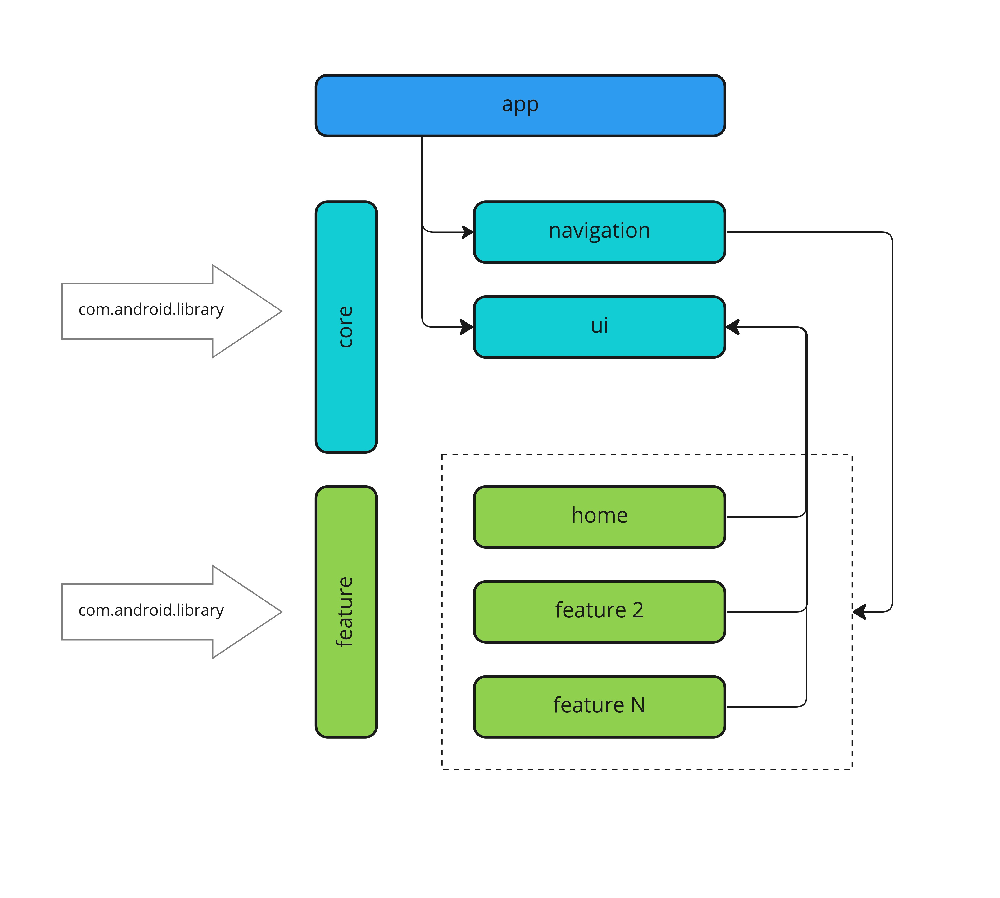

# Android Chat App entirely built with Jetpack Compose


[](https://www.codefactor.io/repository/github/mobiledevpro/jetpack-compose-chatapp-template)
[](https://sonarcloud.io/dashboard?id=mobiledevpro_Jetpack-Compose-ChatApp-Template)

[](http://kotlinlang.org/)
[]([http://kotlinlang.org/](https://developer.android.com/jetpack/compose/bom/bom-mapping))
[](https://developer.android.com/build/releases/gradle-plugin)
[](https://github.com/AndroidSDKSources/android-sdk-sources-list)
[](https://developer.android.com/about/versions/13)
[](http://www.apache.org/licenses/LICENSE-2.0)
[](https://developer.android.com/studio/preview)


##
### Try demo version:
[](https://play.google.com/store/apps/details?id=com.mobiledevpro.closetalk.app&utm_source=landing)

##


[](https://www.youtube.com/playlist?list=PL9IBbMupfHWrW419OtGlzc7cBEMNqyLa4)


##
### Tech. stack

* [Kotlin](https://kotlinlang.org/docs/getting-started.html)
* [Coroutines](https://kotlinlang.org/docs/coroutines-overview.html)
* [Jetpack Compose](https://developer.android.com/jetpack/compose) modern toolkit for building native UI
* [Jetpack libs: Navigation, Compose, etc.](https://developer.android.com/jetpack)
* [Material 3](https://m3.material.io/)
* [Koin](https://insert-koin.io/docs/reference/koin-android/compose) for dependency injection
* [Coil](https://coil-kt.github.io/coil/compose/) for image loading
* MVI + modularization with a clean architecture
* [Circle CI](https://circleci.com/) for continuous integration and delivery
* GitHub Actions [[Complete Guide](https://mobiledevpro.gumroad.com/l/zjbvsd)]

##
## UI testing with [Maestro](https://maestro.mobile.dev/):

* Install Maestro: run in terminal ```curl -Ls "https://get.maestro.mobile.dev" | bash```
* Install the app on emulator (doesn't work with physical device)
* Run the flow: run in terminal ```maestro test -c maestro/people-profile-flow.yaml```
* [Sample config](maestro/people-profile-flow.yaml)

##
## Modularization



##
## Author:

<a href="https://github.com/dmitriy-chernysh" target="_blank">
  
</a>

**Dmitri Chernysh**

[](https://www.youtube.com/@mobiledevpro?sub_confirmation=1)
[](https://www.instagram.com/mobiledevpro/)
[](https://twitter.com/mobiledev_pro)
[](https://www.linkedin.com/in/dmitriychernysh/)

## License:

Copyright 2023 Dmitri Chernysh

Licensed under the Apache License, Version 2.0 (the "License");
you may not use this file except in compliance with the License.
You may obtain a copy of the License at

       http://www.apache.org/licenses/LICENSE-2.0

Unless required by applicable law or agreed to in writing, software
distributed under the License is distributed on an "AS IS" BASIS,
WITHOUT WARRANTIES OR CONDITIONS OF ANY KIND, either express or implied.
See the License for the specific language governing permissions and
limitations under the License.

## Thanks for the support
**Stargazers**

[](https://github.com/mobiledevpro/Jetpack-Compose-ChatApp-Template/stargazers)

**Forkers**

[](https://github.com/mobiledevpro/Jetpack-Compose-ChatApp-Template/network/members)
